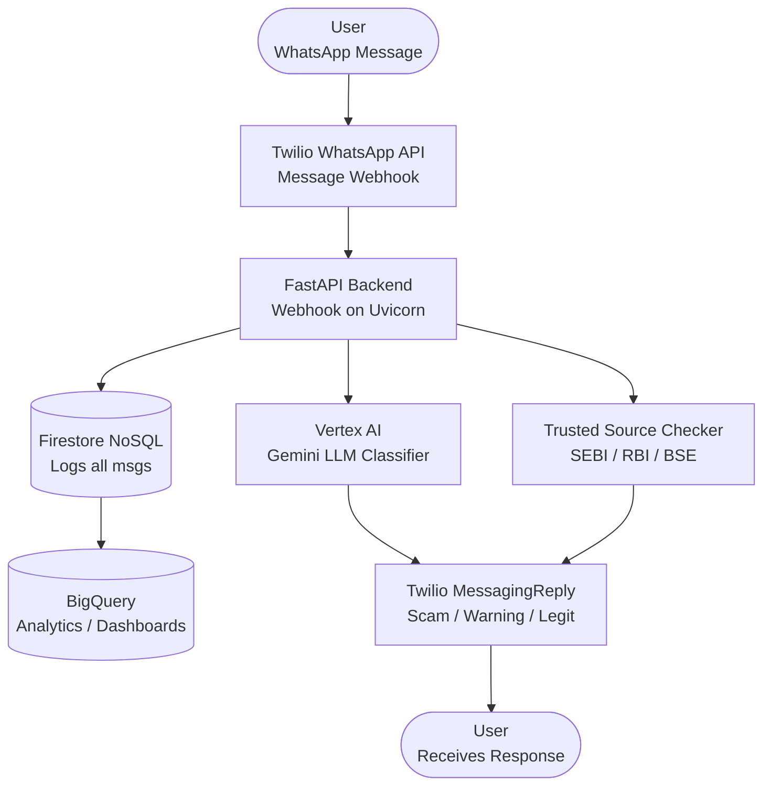

# 🛡️ FinGuard AI – Financial Misinformation Detection

**FinGuard AI** is an AI-powered assistant that detects financial misinformation and scams in real-time. 
It helps users verify WhatsApp messages related to investments, IPOs, cryptocurrencies, and stock market rumors by classifying them as **Scam 🚨**, **Warning ⚠️**, or **Legit ✅**.

*This project was built as part of a Google GenAI Hackathon.*

---

## 🚀 Features

- ✅ **WhatsApp Integration** using Twilio API
- 🤖 **AI-Based Classification** with Google Vertex AI (Gemini 2.0 Flash)
- 🔍 **Cross-checks with Trusted Sources** (SEBI, RBI, BSE updates)
- 📊 **Data Storage & Analytics** with Firestore + BigQuery
- ⚡ **FastAPI Backend** running on Uvicorn
- 📱 **Real-time Scam Alerts** delivered directly to the user’s WhatsApp

---

## 🏗️ Architecture



---

## 📌 Tech Stack

- **Backend:** FastAPI, Uvicorn
- **AI Models:** Google Vertex AI (Gemini 2.0 Flash)
- **Messaging:** Twilio WhatsApp API
- **Database:** Firestore (NoSQL)
- **Analytics:** BigQuery
- **Deployment:** Local / Google Cloud Run

---

## 🛠️ Getting Started

### Prerequisites

Ensure you have the following installed:
- Python 3.8+
- ngrok (for local webhook testing)
- A Twilio account

### Installation

1. Clone the repository:
   ```bash
   git clone https://github.com/VedantVH/FinGuard.git
   cd FinGuard
   ```

2. Install dependencies:
   ```bash
   pip install -r requirements.txt
   ```

3. Set up your environment variables for Twilio and Google Cloud Vertex AI/Firestore.

### Running the Application

1. Run the FastAPI server locally:
   ```bash
   uvicorn app.main:app --reload --port 8080
   ```

2. Expose your local server to the internet using ngrok:
   ```bash
   ngrok http 8080
   ```

3. Set the Twilio Webhook URL to your running FastAPI endpoint:
   ```
   https://<your-ngrok-url>/webhook
   ```

4. Send a WhatsApp message to your Twilio number to test!

---

## 🎯 Future Enhancements

- **Multi-language support:** Support for Hindi, Kannada, Tamil, etc.
- **Image/Screenshot OCR:** Extract text from images to detect scams.
- **Browser Extension:** Verify financial news directly from the browser.
